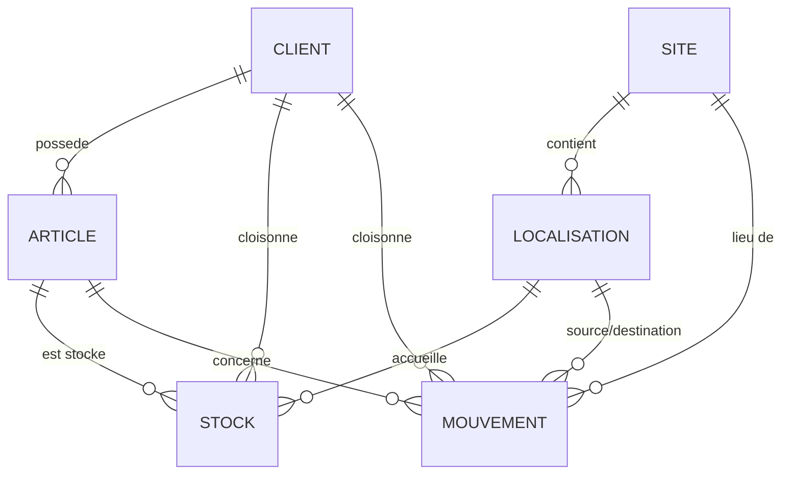

# Modèle de données

Schéma `wms` de la base WMS NordTransit Logistics. Ce document présente le modèle conceptuel (MCD), le modèle logique (MLD), le dictionnaire de données et les règles d'intégrité. Le DDL complet et exécutable se trouve dans `sql/01-schema.sql`.

## 1. Périmètre

Le schéma couvre les six entités demandées par le cahier des charges et les relie par des contraintes explicites.

- Clients, avec séparation des données par client.
- Sites et entrepôts, auxquels sont rattachés stock et transactions.
- Articles et SKU, catalogue avec dimensions et poids nécessaires aux calculs d'expédition.
- Localisations, qui décrivent où et comment l'article est stocké.
- Stock actuel.
- Mouvements, entrées et sorties horodatées.

## 2. Modèle conceptuel de données (MCD)

Le modèle suit une approche Merise. Les entités portent leurs propriétés, les associations portent les cardinalités et, le cas échéant, leurs propres propriétés.

```
  CLIENT (client_id, code, raison_sociale, actif, cree_le)
     |
     | 1,n  possede
     v
  ARTICLE (article_id, sku, libelle, longueur_mm, largeur_mm, hauteur_mm, poids_g, volume_l, actif, cree_le)
     |
     | 1,n  est stocke dans   --> association STOCK (quantite, maj_le)
     v
  LOCALISATION (localisation_id, code, type, capacite_max, actif)
     ^
     | 1,n  contient
     |
  SITE (site_id, code, libelle, ville, actif)

  MOUVEMENT (mouvement_id, type, quantite, reference, utilisateur, date_mouvement)
     - concerne 1,1 ARTICLE
     - se produit sur 1,1 SITE
     - origine 0,1 LOCALISATION (source)
     - destination 0,1 LOCALISATION (destination)
```

Lecture des associations principales.

- Un client possède de zéro à plusieurs articles. Un article appartient à un et un seul client. Le cloisonnement des données part de là.
- Un site contient de zéro à plusieurs localisations. Une localisation appartient à un et un seul site.
- Le stock est l'association entre un article et une localisation. Elle porte la quantité courante et la date de mise à jour. Un couple article et localisation est unique.
- Un mouvement concerne un article et se produit sur un site. Selon son type il référence une localisation source, une localisation destination, ou les deux.

Diagramme entité-association équivalent, rendu par GitHub.



## 3. Modèle logique de données (MLD)

Passage au relationnel. Les clés primaires sont soulignées par la mention PK, les clés étrangères par FK. Les clés étrangères composites sont le coeur du cloisonnement.

```
clients(client_id PK, code U, raison_sociale, actif, cree_le)

sites(site_id PK, code U, libelle, ville, actif)

articles(article_id PK, client_id FK->clients, sku, libelle,
         longueur_mm, largeur_mm, hauteur_mm, poids_g, actif, cree_le,
         volume_l calcule)
         U(client_id, sku)
         U(article_id, client_id)        cle candidate pour FK composite

localisations(localisation_id PK, site_id FK->sites, code, type,
              capacite_max, actif)
              U(site_id, code)
              U(localisation_id, site_id)

stock(stock_id PK, client_id, article_id, localisation_id FK->localisations,
      quantite, maj_le)
      U(article_id, localisation_id)
      FK(article_id, client_id) -> articles(article_id, client_id)

mouvements(mouvement_id PK, client_id, article_id, site_id FK->sites,
           type, quantite, localisation_src FK->localisations,
           localisation_dst FK->localisations, reference, utilisateur,
           date_mouvement)
           FK(article_id, client_id) -> articles(article_id, client_id)
```

Point clé du MLD. Les tables `stock` et `mouvements` ne pointent pas vers `articles` par une simple clé `article_id`. Elles utilisent une clé étrangère composite `(article_id, client_id)` qui référence la clé candidate `(article_id, client_id)` de `articles`. Cela rend impossible l'enregistrement d'un stock ou d'un mouvement dont le `client_id` ne correspond pas au client réel de l'article. Le cloisonnement est garanti par le moteur, pas seulement par l'application.

## 4. Dictionnaire de données

### clients

| Colonne | Type | Contrainte | Description |
|---------|------|-----------|-------------|
| client_id | int identité | PK | Identifiant interne |
| code | text | unique, motif `^[A-Z0-9_]{2,20}$` | Code court du client |
| raison_sociale | text | non nul | Nom légal |
| actif | boolean | défaut vrai | Client actif ou archivé |
| cree_le | timestamptz | défaut now | Date de création |

### sites

| Colonne | Type | Contrainte | Description |
|---------|------|-----------|-------------|
| site_id | int identité | PK | Identifiant interne |
| code | text | unique, motif `^[A-Z0-9]{2,10}$` | Code du site, par exemple WH1 |
| libelle | text | non nul | Nom de l'entrepôt |
| ville | text | non nul | Ville d'implantation |
| actif | boolean | défaut vrai | Site actif |

### articles

| Colonne | Type | Contrainte | Description |
|---------|------|-----------|-------------|
| article_id | bigint identité | PK | Identifiant interne |
| client_id | int | FK clients, non nul | Client propriétaire du SKU |
| sku | text | non nul, unique par client | Référence article |
| libelle | text | non nul | Désignation |
| longueur_mm | int | strictement positif | Dimension, calcul d'expédition |
| largeur_mm | int | strictement positif | Dimension |
| hauteur_mm | int | strictement positif | Dimension |
| poids_g | int | strictement positif | Poids transport |
| volume_l | numeric(12,3) | calculé, stocké | Volume en litres, dérivé des dimensions |
| actif | boolean | défaut vrai | Article actif |
| cree_le | timestamptz | défaut now | Date de création |

### localisations

| Colonne | Type | Contrainte | Description |
|---------|------|-----------|-------------|
| localisation_id | bigint identité | PK | Identifiant interne |
| site_id | int | FK sites, non nul | Site d'appartenance |
| code | text | unique par site | Adresse logique, par exemple A-12-3 |
| type | enum | PICKING, MASSE, QUAI, CROSSDOCK, RETOUR | Nature de l'emplacement |
| capacite_max | int | strictement positif | Capacité de l'emplacement |
| actif | boolean | défaut vrai | Emplacement actif |

### stock

| Colonne | Type | Contrainte | Description |
|---------|------|-----------|-------------|
| stock_id | bigint identité | PK | Identifiant interne |
| client_id | int | partie de la FK composite | Client propriétaire |
| article_id | bigint | FK composite avec client_id | Article |
| localisation_id | bigint | FK localisations | Emplacement |
| quantite | int | supérieur ou égal à zéro | Quantité courante |
| maj_le | timestamptz | défaut now | Dernière mise à jour |

Unicité sur le couple `(article_id, localisation_id)`. Un article n'a qu'une ligne de stock par emplacement.

### mouvements

| Colonne | Type | Contrainte | Description |
|---------|------|-----------|-------------|
| mouvement_id | bigint identité | PK | Identifiant interne |
| client_id | int | partie de la FK composite | Client propriétaire |
| article_id | bigint | FK composite avec client_id | Article concerné |
| site_id | int | FK sites | Site du mouvement |
| type | enum | ENTREE, SORTIE, TRANSFERT, AJUSTEMENT | Nature du mouvement |
| quantite | int | strictement positif | Quantité déplacée |
| localisation_src | bigint | FK localisations, conditionnel | Emplacement source |
| localisation_dst | bigint | FK localisations, conditionnel | Emplacement destination |
| reference | text | optionnel | Référence réception, commande ou EDI |
| utilisateur | text | défaut current_user | Auteur de l'opération |
| date_mouvement | timestamptz | défaut now | Horodatage |

## 5. Règles d'intégrité

### 5.1 Intégrité de domaine

- Les dimensions et le poids des articles sont strictement positifs. Un calcul d'expédition ne peut pas reposer sur une valeur nulle ou négative.
- Le volume est une colonne calculée et stockée, dérivée des trois dimensions. Il ne peut pas diverger des dimensions saisies.
- Les codes client et site suivent un motif d'expression régulière, ce qui évite les saisies incohérentes.

### 5.2 Intégrité référentielle

- Toutes les clés étrangères utilisent `ON DELETE RESTRICT`. On n'efface pas un client, un site, un article ou une localisation tant qu'il reste rattaché à des données. Cela protège l'historique.
- Les clés étrangères composites `(article_id, client_id)` sur `stock` et `mouvements` garantissent la cohérence du client, comme expliqué au point 3.

### 5.3 Intégrité métier sur les mouvements

Une contrainte CHECK impose la présence des localisations selon le type de mouvement.

- ENTREE exige une localisation destination.
- SORTIE exige une localisation source.
- TRANSFERT exige une source et une destination.
- AJUSTEMENT est libre, il sert aux corrections d'inventaire.

### 5.4 Cohérence du stock par déclencheur

La quantité de stock n'est jamais écrite directement par l'application. Elle est maintenue par le déclencheur `appliquer_mouvement()`, exécuté après chaque insertion dans `mouvements`.

- ENTREE et TRANSFERT créent ou incrémentent la ligne de stock à destination.
- SORTIE et TRANSFERT décrémentent la ligne de stock à la source. Si la ligne n'existe pas, le mouvement est rejeté.
- AJUSTEMENT fixe la quantité à la valeur indiquée.

La contrainte `quantite >= 0` sur `stock` bloque tout passage en négatif. Une sortie supérieure au stock disponible échoue, et la transaction entière est annulée. Le stock reste donc toujours cohérent avec la somme des mouvements.

Ce déclencheur est défini en `SECURITY DEFINER`, ce qui permet à un compte qui n'a le droit d'écrire que dans `mouvements` de déclencher la mise à jour du stock sans posséder de droit d'écriture direct sur la table `stock`. Le détail figure dans la politique de sécurité.

## 6. Vue de service

La vue `v_stock_par_site` consolide le stock par client, par site et par SKU. Elle évite aux applications de reporting de réécrire la jointure entre stock, articles, localisations et sites, et sert de point d'accès stable en lecture.

## 7. Volume de test

Le schéma a été chargé avec un jeu représentatif pour mesurer les performances sur des données réalistes.

| Entité | Volume |
|--------|--------|
| Clients | 3 |
| Sites | 4 |
| Localisations | 240 |
| Articles | 1 800 |
| Mouvements | 131 800 |

Ce volume sert de base aux mesures présentées dans la démarche d'optimisation.
